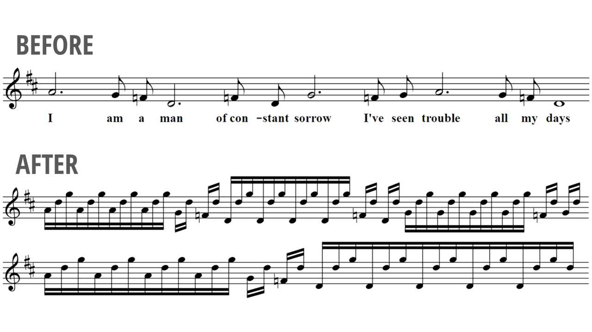

# Let's program a banjo grammar!

For my talk at [Deconstruct 2018](https://www.deconstructconf.com/), I made a context-free grammar to transform plain melodies into bluegrass banjo style. Here's an example:

<video controls width="100%">
    <source src="example-animation.mp4" type="video/mp4">
    
</video>

## Notebook

[Here's the Jupyter Notebook](http://nbviewer.jupyter.org/github/rrherr/banjo-grammar/blob/master/banjo-grammar.ipynb). You can see the Python code, listen to 22 music clips, and read Markdown explanations step by step. 

(The notebook file is a 30 MB download, because it has embedded, uncompressed audio. The notebook should be viewed with [nbviewer](http://nbviewer.jupyter.org/), because GitHub does not render audio in notebooks.)

## Installation

If you want to see the code and listen to the music, you don't need to install anything, you can just view the [notebook](http://nbviewer.jupyter.org/github/rrherr/banjo-grammar/blob/master/banjo-grammar.ipynb). 

If you want to change the code and run it for yourself, please follow these instructions:

- Clone the [repository](https://github.com/rrherr/banjo-grammar/).
- Download & install [Anaconda distribution, Python 3](https://www.anaconda.com/download/). (Anaconda includes [Jupyter](http://jupyter.org/) for notebooks, [NLTK](http://www.nltk.org/) for context-free grammars, and more.)
- Download & install these three command line utilities, and add them to your system path. (Binaries are available for Linux, Mac, and Windows.) 
    - [abcm2ps](http://abcplus.sourceforge.net/#abcm2ps) (for ABC → SVG sheet music)
    - [abc2midi](http://abcplus.sourceforge.net/#abcmidi) (for ABC → MIDI music)
    - [Qsynth](https://sourceforge.net/projects/qsynth/) (includes [fluidsynth](http://www.fluidsynth.org/), for MIDI → WAV audio)
- Download [GeneralUser GS v1.471.sf2](http://schristiancollins.com/generaluser.php). (It's a "soundfont", used by fluidsynth.) Put it in the same directory as the repository.

## Wiki

[Visit the wiki](https://github.com/rrherr/banjo-grammar/wiki) (a work in progress) for links to learn more about related topics.

## Contact

I'd love to hear from you! Please contact me at [rrherr@gmail.com](mailto:rrherr@gmail.com) or on Twitter, [@rrherr](https://twitter.com/rrherr).
